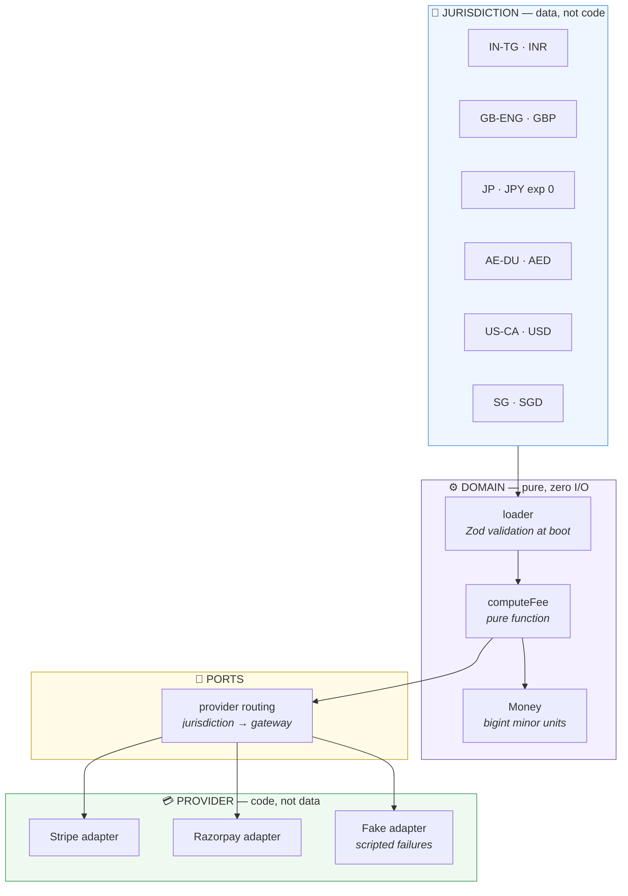
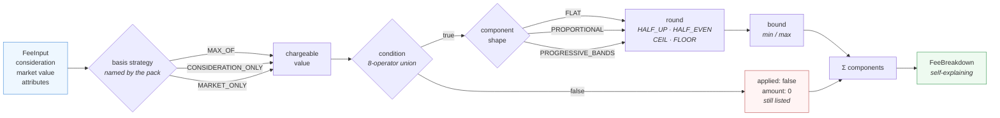
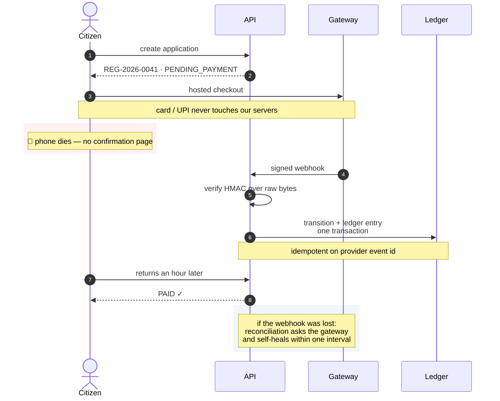

<div align="center">

# Registry Payments

**A multi-jurisdiction property registration payment platform — where adding a country is a config file, and adding a payment gateway is one adapter.**

[](https://www.typescriptlang.org/)
[](https://nodejs.org/)
[](https://zod.dev/)
[](https://react.dev/)
[](https://vitest.dev/)
[](#proof-not-claims)
[](#the-central-claim)

</div>

---

## The problem

Registering a property transfer requires paying statutory taxes before a deed can be recorded — stamp duty in India and the UK, transfer tax in the US, land registry fees in Japan and Dubai. Four properties make this payment unlike ordinary e-commerce:

| Property | Consequence for the design |
|---|---|
| A single **large** payment | A double-charge is a legal incident, not a support ticket |
| The receipt is **legal evidence** | It must be immutable and reproducible years later |
| Payment success ≠ registration success | A rejected deed triggers a refund against settled money |
| The browser is an **unreliable narrator** | Only the signed gateway webhook can be trusted |

Most integrations treat the browser redirect as truth. This one does not.

> [!IMPORTANT]
> **All fee rates in this repository are synthetic.** Every rule pack is marked `SYNTHETIC` and the loader **fails at boot** on any pack with unmarked rates. This is a working engine, not a tax calculator.

---

## See it run

Six jurisdictions, six currencies, one engine with no jurisdiction-specific branches. Every frame below is real terminal output — no dev server, no database, no API keys.

<div align="center">
  
</div>

Three currencies, three fee structures, three basis strategies — and the same `computeFee` call behind all of them.

- **￥1,250,000** — a **zero-decimal** currency. Not `￥12,500.00`. Any hardcoded "divide by 100" dies here.
- **₹50,00,000.00** — **lakh grouping**, not `₹5,000,000.00`. The chargeable value is the *higher* of market value and price paid, so `MAX_OF_MARKET_AND_CONSIDERATION` picks the ₹50,00,000 market value over the ₹48,00,000 consideration.
- **AED 101,100.00** — a mortgage component that only exists because `mortgaged=true` was passed, charged against a *different* basis (the loan amount) from every other component.

### One minor unit changes everything

<div align="center">
  
</div>

Two runs, **one penny apart**. At £425,000.00 first-time buyer relief applies and the duty is £0.00. One minor unit higher, the relief drops out entirely and the duty jumps to £6,750.00.

The registry fee is £650.00 either way — which is why the total goes **£650.00 → £7,400.00** rather than to zero. "Pays nothing" would be wrong; the relief covers duty, not fees. That boundary has a test on both sides of it.

Note what the output still shows on the losing side: the relief is listed as `not applied` rather than omitted, and the 0% band is printed rather than hidden. A citizen can see the whole schedule, including the relief they missed by a penny.

---

## What this project demonstrates

| Capability | Evidence in this repo |
|---|---|
| **Domain-driven design** | A pure domain layer with zero I/O, zero clock, zero randomness — the fastest and most-tested part of the system |
| **Financial correctness** | `bigint` minor units, per-currency ISO 4217 exponents, integer parts-per-million rates, four explicit rounding modes, no float anywhere |
| **Pluggable architecture, falsifiably** | Four of six jurisdictions were added with **zero lines of engine code** — provable by one `git diff` |
| **Schema-driven validation** | Zod 4 recursive discriminated unions validate every rule pack at boot; a malformed pack cannot reach runtime |
| **Enforcement over convention** | Two test suites read the source as text to enforce invariants the type system cannot express |
| **Multi-currency from day one** | Six currencies including JPY (zero decimals); cross-currency arithmetic throws by construction |
| **Systems thinking** | Webhook-as-source-of-truth, idempotency keyed on provider event id, self-healing reconciliation, append-only ledger |

---

## Tech stack

<table>
<tr><td><b>Language</b></td><td>TypeScript 6.0 — <code>strict</code>, <code>erasableSyntaxOnly</code>, <code>noUncheckedIndexedAccess</code></td></tr>
<tr><td><b>Runtime</b></td><td>Node.js 24 with native type stripping — no build step, packages export source directly</td></tr>
<tr><td><b>Validation</b></td><td>Zod 4 — recursive <code>discriminatedUnion</code> + <code>strictObject</code>, boot-time rule pack schemas</td></tr>
<tr><td><b>HTTP</b></td><td>Express 5 — two endpoints, no DTO layer: <code>FeeBreakdown</code> already serialises to the wire</td></tr>
<tr><td><b>Client</b></td><td>React 19 + Vite 7 — a form generated from rule-pack metadata, not from per-country components</td></tr>
<tr><td><b>Testing</b></td><td>Vitest 3.2 — 451 tests across 23 suites, including 149 generated golden-fixture assertions and an end-to-end HTTP suite</td></tr>
<tr><td><b>Linting</b></td><td>oxlint 1.80 (Rust) — plus two source-scanning guard suites for rules a linter cannot express</td></tr>
<tr><td><b>Monorepo</b></td><td>npm workspaces</td></tr>
<tr><td><b>CI</b></td><td>GitHub Actions — typecheck, lint, test, client build</td></tr>
<tr><td><b>Planned</b></td><td>Prisma + SQLite → Postgres · Stripe + Razorpay · Playwright</td></tr>
</table>

---

## System design

### Layered architecture — and why the layers point one way



**The decision that shapes everything:** *what is owed* is data; *how it is collected* is code. They meet only in a routing config. Conflate them and every new country becomes a code change.

`money/` imports nothing from `fees/`. `fees/` imports `money/`. Nothing imports `config/` except the loader. No cycles.

### The fee engine — one pure function, three component shapes



Two orderings in that diagram are load-bearing and pinned by tests:

- **Round, then bound.** A statutory minimum is expressed in the granularity the pack rounds to — bounding first would produce a minimum that rounding then violates.
- **Round each component, then sum.** Never sum then round. On a real Telangana case the difference is one minor unit — `94075` versus `94074` — which is exactly the class of discrepancy that fails a reconciliation months later.

### Payment truth — the browser never decides



**Why this matters:** the citizen is never the one who has to notice something went wrong. Webhook signature verification runs over **raw body bytes** before any JSON parser touches them — a parse-and-reserialize changes the bytes and breaks every signature, which is the single most common bug in this problem space.

---

## The central claim

> **Adding a jurisdiction requires zero engine code.**

Not asserted — falsifiable. The last four of six jurisdictions were added across five commits. Run this:

```bash
git diff --name-only HEAD~5 HEAD -- packages/domain/src
```

**Output: empty.** Those five commits touched rule packs, fixtures, the CLI and docs — and not one line of engine source.

And they were not easy jurisdictions. Each was chosen to break a naive engine:

| Jurisdiction | What it forced the engine to already support |
|---|---|
| 🇯🇵 **Japan** | A **zero-decimal currency** — `¥1,250,000`, never `¥12,500.00`. Any hardcoded "divide by 100" dies here |
| 🇬🇧 **England** | Two **mutually exclusive band schedules** selected by a negated condition — first-time-buyer relief with a cliff |
| 🇦🇪 **Dubai** | A component whose basis is an **attribute**, not the chargeable value (mortgage amount) |
| 🇺🇸 **California** | A **county sub-schedule inside one pack**, a per-document multiplier, and both a floor and a cap |
| 🇸🇬 **Singapore** | **Two stacked band schedules**, the second gated on residency |

Sub-jurisdictional variation is data too. California's counties do not need one pack per county.

---

## Code structure

```
payment-gateway/
│
├── config/                      📄 DATA — jurisdiction knowledge lives ONLY here
│   ├── jurisdictions/              6 versioned rule packs, Zod-validated at boot
│   └── fixtures/                   6 golden files · 19 pinned cases
│
├── packages/domain/             ⚙️ PURE — zero I/O, zero clock, zero randomness
│   ├── src/money/                  currency · money · rounding · format · wire
│   ├── src/fees/                   types · schema · condition · basis
│   │                               components · compute · loader
│   └── tests/
│       ├── money/  fees/           343 behavioural tests
│       └── guards/                 17 tests that read src/ as TEXT
│
├── packages/api/                🌐 HTTP — Express over the registry, no persistence
│   ├── src/routes/                 jurisdictions · quote
│   ├── src/errors.ts               one place mapping domain errors to status codes
│   └── tests/                      49 tests, incl. a guard over api/ AND web/
│
├── packages/web/                 🖱️ CLIENT — React 19 + Vite
│   ├── src/components/             AttributeFields renders whatever a pack declares
│   ├── src/money.ts                MoneyWire → glyphs, never via a JS number
│   └── tests/                      42 tests
│
├── tools/quote.ts               🖥️ CLI — proves the engine with no server
├── docs/                        📚 PRD · architecture · domain model · testing
└── design/                      🎨 15 hi-fi artboards
```

**Style, at a glance:**

```typescript
export class Money {
  readonly amountMinor: bigint
  readonly currency: CurrencyCode
  private constructor(amountMinor: bigint, currency: CurrencyCode) { /* … */ }
  //  ↑ Money.of() is the only door in — you cannot hold an unvalidated Money
}

export class CurrencyMismatchError extends Error {
  constructor(left: CurrencyCode, right: CurrencyCode, operation: string) {
    super(
      `Cannot ${operation} across currencies: ${left} and ${right}. ` +
        'Mixing currencies is a defect, not a conversion — this system does no FX.',
    )
  //  ↑ every custom error states why the rule exists, in the message
  }
}
```

Closed discriminated unions with exhaustive `switch` and **no `default` arm** — so adding a variant is a compile error, never a silent runtime fallthrough. Explicit `.ts` import extensions (there is no build step). `readonly` on every interface field. Comments say *why*, and name the alternative that was rejected.

---

## Proof, not claims

| Claim | How to check it |
|---|---|
| 451 tests pass | `npm test` |
| Zero engine code for the last 4 jurisdictions | `git diff --name-only HEAD~5 HEAD -- packages/domain/src` → empty |
| No float arithmetic on money | `npm test -- no-float-money` — a guard suite that greps `src/` |
| No jurisdiction id branched on in the engine, the API **or the client** | `npm test -- no-jurisdiction-branch` |
| The browser, the CLI and the golden fixtures agree | `npm test -- quote` pins the same totals the CLI prints |
| Money never crosses the wire as a JSON number | `npm test -- quote` — a numeric `amountMinor` is a 400 |
| Every pack has golden fixtures | A pack without them fails CI — the suite globs the pack directory |
| A zero-decimal currency renders correctly | `npm run quote -- --jurisdiction JP --consideration 60000000` |

**Scale:** 1,507 lines of source · 2,128 lines of tests · 736 lines of jurisdiction data · 6 currencies · 19 golden cases.

The test-to-source ratio is deliberate. In a money engine, the arithmetic is short and the ways it can be wrong are many.

---

## Quick start

```bash
npm install
npm test
npm run quote -- --all
```

No build step, no database, no API keys. The CLI exercises the real engine over the real rule packs.

### Run it in a browser

Two terminals, no database and no configuration:

```bash
npm run dev:api    # Express on :4000, loads and validates all six packs at boot
npm run dev:web    # Vite on :5173, proxies /api — so there is no CORS anywhere
```

Open `http://localhost:5173`. Pick a jurisdiction and the form changes shape, because **the fields come from the rule pack**:

| Jurisdiction | Fields the pack asks for |
|---|---|
| Japan | *none* — its fees depend only on value |
| England | a first-time-buyer checkbox |
| Dubai | a mortgage checkbox, then a loan amount |
| California | a county `select`, and a document count |
| Singapore | a residency `select` of three options |

`packages/web/src/components/AttributeFields.tsx` maps an attribute's *kind* to a control — `string` with options to a `select`, `boolean` to a checkbox — and contains no jurisdiction name at all. Adding a seventh country adds a JSON file and changes no component. A [guard test](packages/api/tests/guards/no-jurisdiction-branch.test.ts) fails the build if a pack id ever appears in the API or the client.

The same £1 cliff from [above](#one-minor-unit-changes-everything) is reproducible in the browser, and prints the same £650.00 → £7,400.00 the CLI does.

<details>
<summary><b>The same England quote as selectable text</b></summary>

```
$ npm run quote -- --jurisdiction GB-ENG --consideration 42500001 --attr firstTimeBuyer=true

England, United Kingdom (synthetic)  ·  GB-ENG 2026.1  ·  GBP
────────────────────────────────────────────────────────────────────────
Chargeable value   £425,000.01
Basis              CONSIDERATION_ONLY

  Transfer duty                                           £6,750.00
      band 0–15000000 on 15000000 at 0%  £0.00
      band 15000000–30000000 on 15000000 at 2%  £3,000.00
      band 30000000–above on 12500001 at 3%  £3,750.00
  Transfer duty — first-time buyer relief                         —   not applied
  Land registry fee                                         £650.00
────────────────────────────────────────────────────────────────────────
  TOTAL PAYABLE                                           £7,400.00

  ⚠  Illustrative rates for demonstration only — not this jurisdiction’s actual fees, and not an official assessment.
     Provenance: SYNTHETIC
```

The golden fixtures assert on which components were **skipped**, not only on the total — so a relief silently vanishing from a rule pack fails CI instead of quietly under-charging someone.

</details>

---

## Documentation

| Document | Contents |
|---|---|
| [**Architecture**](docs/ARCHITECTURE.md) | Layer boundaries, the two pluggability axes, repository layout, interface design |
| [**Domain model**](docs/DOMAIN-MODEL.md) | The five money decisions, basis strategies, component shapes, the condition union, worked rounding examples |
| [**Correctness strategy**](docs/TESTING.md) | Boundary testing, the source-scanning guards, the provenance guard, full 16-suite inventory |
| [**Engineering notes**](docs/ENGINEERING-NOTES.md) | Toolchain findings, roadmap, known limitations, what is deliberately out of scope |
| [**Handover**](docs/HANDOVER.md) | Current state, prerequisites, decisions already settled, what to build next — written for picking the project up cold |
| [**Product requirements**](docs/superpowers/specs/2026-08-25-property-registration-payments-prd.md) | The full PRD — user journeys, functional requirements, API surface, risk register |

---

## Roadmap

**Plan 1 — domain layer — is complete:** money primitives, fee engine, six jurisdictions, CLI.

**Plan 3 — HTTP API and quote UI — is complete:** `GET /api/jurisdictions`, `POST /api/fees/quote`, and a React page that quotes any of the six jurisdictions in the browser. No persistence, no auth, no payments.

Next: persistence and application lifecycle (Prisma) → the `PaymentProvider` port and Stripe adapter → idempotency and reconciliation hardening → Razorpay and routing → refunds and the append-only ledger → clerk queue and admin console.

Later plans are deliberately unwritten. Their interfaces should be authored against signatures that have actually run, not signatures that were imagined.

---

## License

MIT
