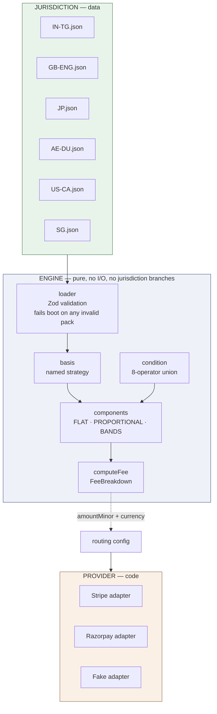

# Registry Payments

**A payment integration for statutory property-registration fees, built to be
correct across six jurisdictions and two payment gateways — where adding a
country is a JSON file and adding a gateway is one adapter.**

Registering a property transfer requires paying statutory charges before a deed
can be recorded: stamp duty in India, transfer duty in England, registration and
licence tax in Japan, a transfer fee in Dubai, documentary transfer taxes in
California, buyer stamp duty in Singapore. Every jurisdiction levies a different
set of components, on a differently-defined chargeable value, in its own
currency, with its own rounding rules.

This is a proof of concept for doing that correctly. It exists because the
payment is unusual compared to ordinary e-commerce in four specific ways, and
most integrations handle none of them:

| Property of the domain | Consequence for the design |
|---|---|
| A single large payment, legally significant | A double-charge is an incident, not a support ticket — exactly-once is a database constraint, not a code check |
| The receipt is legal evidence | It must be reproducible years later, so the fee rules are versioned and the version is persisted with the assessment |
| Payment success ≠ registration success | A rejection triggers a refund against an already-settled payment, so the money model is an append-only ledger |
| The browser is an unreliable narrator | The gateway webhook is the only trustworthy signal; the redirect is advisory |

> ### ⚠ All fee rates in this repository are synthetic
>
> Every rate in `config/jurisdictions/` is **illustrative demonstration data**.
> It is not any jurisdiction's actual statutory fee, and no output of this
> system is an official assessment. This is enforced mechanically, not by
> convention: a rule pack must declare `"provenance": "SYNTHETIC"` or
> `"SOURCED"` (with a citation URL and retrieval date), and the loader **fails
> the boot** on a pack that declares neither. See
> [Provenance is a blocking guard](#provenance-is-a-blocking-guard).

---

## Status

**The domain layer is complete and verified.** HTTP, persistence, gateway
adapters, and UI are specified but not yet built — see [Roadmap](#roadmap).

| | |
|---|---|
| **Tests** | 360 across 16 files, all passing |
| **Jurisdictions** | 6 loading, computing, and pinned by golden fixtures |
| **Engine source** | ~1,500 lines TypeScript |
| **Test source** | ~2,100 lines |
| **Engine code needed for the last 4 jurisdictions** | **zero** — see [Adding a jurisdiction](#adding-a-jurisdiction) |

Stack: Node 24 · TypeScript 6.0 (strict, `noUncheckedIndexedAccess`,
`exactOptionalPropertyTypes`, `erasableSyntaxOnly`) · Zod 4 · Vitest 3 ·
oxlint 1. No build step — the package's `exports` points at source, and the CLI
runs under Node's native type stripping.

---

## Quick start

```bash
npm install
npm run quote -- --all
```

One command, six jurisdictions, six currencies. Then:

```bash
npm test          # 360 tests
npm run lint      # oxlint
npm run typecheck # tsc over src AND tests
```

### Sample output

```
Japan (synthetic)  ·  JP 2026.1  ·  JPY
────────────────────────────────────────────────────────────────────────
Chargeable value   ￥60,000,000
Basis              CONSIDERATION_ONLY

  Registration and licence tax  2%                       ￥1,200,000
  Judicial scrivener fee                                    ￥50,000
────────────────────────────────────────────────────────────────────────
  TOTAL PAYABLE                                          ￥1,250,000

  ⚠  Illustrative rates for demonstration only — not this jurisdiction’s
     actual fees, and not an official assessment.
     Provenance: SYNTHETIC
```

Note there is **no decimal separator**. JPY has a minor-unit exponent of 0 — the
yen *is* the minor unit. `¥1,250,000.00` would be a defect, and it is the single
most common bug in multi-currency money code.

England, by contrast, shows its working band by band:

```
England, United Kingdom (synthetic)  ·  GB-ENG 2026.1  ·  GBP
────────────────────────────────────────────────────────────────────────
Chargeable value   £395,000.00
Basis              CONSIDERATION_ONLY

  Transfer duty                                           £5,850.00
      band 0–15000000 on 15000000 at 0%  £0.00
      band 15000000–30000000 on 15000000 at 2%  £3,000.00
      band 30000000–above on 9500000 at 3%  £2,850.00
  Transfer duty — first-time buyer relief                         —   not applied
  Land registry fee                                         £650.00
────────────────────────────────────────────────────────────────────────
  TOTAL PAYABLE                                           £6,500.00
```

The relief is **listed and marked not applied**, not silently omitted. A citizen
can see that the rule exists and why it did not fire — which is the difference
between a total they can check and a number they have to phone someone about.

### Other invocations

```bash
# A specific quote
npm run quote -- --jurisdiction IN-TG --consideration 480000000 --market 500000000

# California: the county attribute selects a sub-schedule inside the same pack
npm run quote -- --jurisdiction US-CA --consideration 85000000 \
  --attr county="Los Angeles" --attr documentCount=8

# Machine-readable, for the HTTP layer's future contract tests
npm run quote -- --all --json
```

All amounts on the command line are in **minor units** — `480000000` is
₹48,00,000.00. There is no place in this system where a human-readable amount is
also a computable one.

---

## Architecture

Two independent axes of pluggability, deliberately kept apart:



**Jurisdiction is data. Provider is code. They meet only in routing config.**

Conflating them is the design mistake this structure exists to avoid: if the fee
rules lived in code, every new country would be a deployment; if the gateway
integration lived in data, the adapter's error handling would be
unrepresentable. Six countries cost six JSON files. Two gateways cost two
adapters. Neither multiplies the other.

The engine contains **zero jurisdiction-specific branching**, and that is
enforced by a test that reads the source (see
[The guards](#the-guards-tests-that-read-the-source)).

---

## The money model

There is no bare numeric money type anywhere in the codebase.

```typescript
class Money {
  readonly amountMinor: bigint      // integer minor units, never a float
  readonly currency: CurrencyCode   // never optional, never inferred
}
```

Five decisions worth explaining, because each of them is a bug class closed:

### 1. `bigint` minor units, never floating point

`0.1 + 0.2 !== 0.3`. For a fee of ₹3,00,200 that error is invisible; summed
across a ledger it is a reconciliation failure. Every amount is an integer
number of the currency's smallest unit, and arithmetic is exact.

Rates are **integer parts-per-million**, not float percentages: `0.5%` is
`5000`, `4%` is `40000`. There is no `0.04` anywhere.

### 2. Minor units are per-currency, never assumed to be two

```typescript
INR, GBP, SGD, AED, USD → exponent 2
JPY                     → exponent 0     // the yen IS the minor unit
KWD, BHD                → exponent 3     // fils
```

Every format, parse, and rounding operation reads the exponent from the currency
registry. A hardcoded `/ 100` is a defect, and a guard test enforces that.
The test matrix mandates coverage of all three exponent classes.

### 3. Mixing currencies throws

```typescript
Money.of(100n, 'GBP').add(Money.of(100n, 'INR'))
// CurrencyMismatchError: Cannot add across currencies: GBP and INR.
// Mixing currencies is a defect, not a conversion — this system does no FX.
```

This system performs no FX and holds no rates. A cross-currency operation is
always a bug, so it fails loudly rather than producing a plausible number. The
ledger therefore balances **per currency**; there is no global total anywhere,
because summing across currencies is meaningless.

### 4. Rounding is explicit, named, and never implicit

```typescript
type RoundingMode = 'HALF_UP' | 'HALF_EVEN' | 'CEIL' | 'FLOOR'
```

`CEIL` means toward +∞ and `FLOOR` means toward −∞ — *not* away from and toward
zero. That distinction is load-bearing because refunds are negative amounts.

The rule pack names the mode **per component**, and also the step: a
jurisdiction that rounds duty up to the whole currency unit sets
`roundToStepMinor` to `10^exponent` with `CEIL`.

**Components are rounded individually, then summed. Never summed then rounded.**
This is pinned by a fixture rather than trusted:

```
1234567 × 40000 ppm = 49382.68 → 49383
1234567 × 15000 ppm = 18518.50 → 18519
1234567 ×  5000 ppm =  6172.84 →  6173
flat                             20000
                              ────────
round-then-sum                   94075   ← the correct answer, pinned
sum-then-round                   94074   ← what a naive engine returns
```

### 5. Money crosses the wire as a string

JSON has no BigInt. `JSON.stringify(9007199254740993n)` throws, and coercing to
`Number` silently loses precision above 2⁵³.

```json
{ "amountMinor": "1250000", "currency": "JPY" }
```

The server never sends a *formatted* string as data, and the client never does
arithmetic. `FeeBreakdown` holds wire-shaped money at birth rather than `Money`
instances, so there is no path by which a `Money` reaches `JSON.stringify` and
serialises to `{}`.

---

## The fee engine

```typescript
computeFee(input: FeeInput, pack: JurisdictionRulePack): FeeBreakdown
```

Pure. No I/O, no clock, no randomness, no jurisdiction branching. Fully
unit-testable, and tested for determinism and input-immutability explicitly.

### Chargeable value is a pack decision, not a hardcoded rule

Jurisdictions genuinely differ on *what* the fee is charged on:

| Strategy | Used by | Behaviour |
|---|---|---|
| `MAX_OF_MARKET_AND_CONSIDERATION` | India | Charges the higher of assessed value and price paid |
| `CONSIDERATION_ONLY` | England, Japan, Dubai, California, Singapore | Charges the price actually paid |
| `MARKET_ONLY` | — | Available; no shipped pack uses it |

The pack names the strategy; the engine applies the named one. A Dubai fixture
proves this is real rather than incidental: market value is AED 2,600,000 but the
transfer fee computes on the AED 2,400,000 paid. The same input under India's
strategy would charge the higher figure.

### Three component shapes cover every real schedule

```typescript
type FeeComponentRule = FlatRule | ProportionalRule | ProgressiveBandsRule
```

- **`FLAT`** — a fixed amount, optionally multiplied by a numeric attribute
  (a per-document recording fee)
- **`PROPORTIONAL`** — `ratePpm` applied to the chargeable value, or to a named
  attribute instead (a mortgage fee charged on the loan, not the property)
- **`PROGRESSIVE_BANDS`** — ordered bands charged **marginally**, each on its own
  slice only

Plus, on every component: a `condition`, a `rounding` mode, a
`roundToStepMinor`, and optional `minAmountMinor` / `maxAmountMinor`.

Order of operations is **round, then bound**. A minimum is expressed in the
granularity the pack rounds to, so rounding afterwards could push a bounded
amount back below its own floor.

### Conditions are a closed eight-operator union

```typescript
type Condition =
  | { op: 'always' }
  | { op: 'eq';       attribute: string; value: string | number | boolean }
  | { op: 'lte' }     | { op: 'gte' }      // numeric attribute thresholds
  | { op: 'basisLte' }| { op: 'basisGte' } // thresholds on the chargeable value
  | { op: 'not';  of: Condition }
  | { op: 'all';  of: Condition[] }
  | { op: 'any';  of: Condition[] }
```

England's first-time-buyer relief is `all of (firstTimeBuyer eq true,
basisLte 42500000)` — and the *negation* of that same tree gates the standard
schedule, so the two are mutually exclusive by construction rather than by two
rules that must be kept in agreement.

**A missing attribute throws; it never evaluates false.** A silently-false
condition drops a fee component, which under-charges a statutory fee — the worst
direction for this to fail in, and invisible in the total.

`eq` uses strict identity, so the string `"true"` never equals the boolean
`true`. Form input arrives as strings often enough that coercion here would be a
live bug rather than a hypothetical one.

### Every breakdown explains itself

`FeeBreakdown` is designed so a citizen can verify the number without help. Each
component reports its basis, its rate, every band it walked with that band's
slice, and an `appliedRules` list naming each rule that fired — the condition it
satisfied, the rounding performed, and whether a bound bound:

```json
{
  "code": "AFFORDABLE_HOUSING_FEE",
  "applied": true,
  "amount": { "amountMinor": "22500", "currency": "USD" },
  "appliedRules": [
    { "code": "CONDITION",   "detail": "always applies" },
    { "code": "FLAT",        "detail": "flat 3750 minor units times documentCount = 8" },
    { "code": "MAX_APPLIED", "detail": "capped at the maximum of 22500 minor units" }
  ]
}
```

A bound appears in `appliedRules` only when it **actually bound** — a cap that
did not bite is not reported, because a breakdown listing every rule that
*could* have applied is noise rather than an explanation.

---

## Adding a jurisdiction

The claim is that a new jurisdiction costs one rule-pack file and one fixture
file, with no TypeScript change. It is verified rather than asserted:

```bash
$ git diff --name-only HEAD~5 HEAD -- packages/domain/src
$                     # empty
```

Those five commits added **Japan, Dubai, California and Singapore**. Between
them they exercise:

| Jurisdiction | What it forced the abstraction to handle |
|---|---|
| **JP** | A zero-decimal currency, where the minor unit is the major unit |
| **AE-DU** | `CONSIDERATION_ONLY` basis; a conditional component; a component charged on a named attribute (the loan) rather than the chargeable value |
| **US-CA** | Sub-jurisdictional variation — a county attribute selects a city-tax sub-schedule *inside one pack*; per-document multipliers; a minimum binding upward and a cap binding downward |
| **SG** | Two independent progressive schedules stacked on the same value; a flat fee finer than any rate granularity |

Eight JSON files. Zero lines of TypeScript. Any one of those would normally
arrive as `if (jurisdiction === 'JP')`.

The reason none did is an ordering decision: the pack schema was built with its
*whole* expressiveness surface up front — including operators no pack needed yet
— rather than grown per jurisdiction. Had the schema grown incrementally, each
new jurisdiction would have found it one feature short, and the shortfall would
have gone into code.

### The mechanism that keeps it honest

The golden test suite discovers packs by **reading the directory**, so a pack
added without fixtures fails CI. "Adding a jurisdiction is a JSON file" is only
true if the JSON file is also verified.

```
config/
  jurisdictions/IN-TG-2026.1.json      ← the rules
  fixtures/IN-TG.golden.json           ← 19 cases across 6 packs, pinning
                                         chargeable value, every component
                                         amount, which components did NOT
                                         apply, and the total
```

The `notApplied` assertion is what makes these regression tests rather than total
checks: it pins *which* rules fired, so a condition that silently starts matching
everything is caught even when the total happens to be unchanged.

---

## Correctness strategy

Three mechanisms, each covering something the others cannot.

### 1. Boundary tests where the arithmetic is riskiest

Band boundaries are the highest-risk arithmetic in the system, so every bound in
a three-band schedule is pinned at **one minor unit below, exactly at, and one
above**:

```
149,999.99  → entirely 0% band          (below)
150,000.00  → entirely 0% band          (at — the bound is inclusive)
150,000.01  → one penny into the 2% band (above)
```

And the relief cliff, which is real behaviour in banded relief schemes. At
£425,000.00 a first-time buyer pays **no duty** (the £650.00 registry fee still
applies). One penny higher, relief vanishes entirely and standard duty applies to
the whole value:

```
consideration £425,000.00  →  duty £0.00      total £650.00
consideration £425,000.01  →  duty £6,750.00  total £7,400.00
```

A cliff worth £6,750 across one penny is exactly the kind of boundary a
hand-written test picks a round number either side of and misses.

### 2. The guards: tests that read the source

Two properties the spec states as blocking are properties of the **source text**,
not of any function's behaviour, and oxlint has no custom-rule facility. So they
are tests that scan `src/`:

| Guard | Forbids |
|---|---|
| `no-float-money` | `Number(x.amountMinor)`, `parseFloat`, hardcoded `/ 100`, float literals in a money or rate context, `Math.round` on an amount, and bare arithmetic on a minor amount outside the two money primitives |
| `no-jurisdiction-branch` | Any pack id, country name, or jurisdiction-specific literal anywhere in `src/fees` |

Both strip comments first — which is what lets `basis.ts` explain in prose *why*
India and England differ without tripping the guard. Documenting a jurisdictional
difference is right; branching on one is not.

**Both guards have been deliberately violated and observed to fail**, then pass
again. A guard that has never gone red is not a guard — and this is not
ceremony. The float guard passed on first write and would have shipped as
"working", but the planted violation revealed that its
hardcoded-divide-by-100 pattern was blind to `Number(m.amountMinor) / 100` —
the single most canonical form of the bug — because a closing paren sits between
the identifier and the operator.

### 3. Provenance is a blocking guard

```
provenance: "SOURCED"    → requires packSource (citation URL) AND
                           packRetrievedAt, or the boot throws
provenance: "SYNTHETIC"  → rates are illustrative; the label is suffixed
                           "(synthetic)", every breakdown carries
                           provenance and a disclaimer
```

There is no third state. A pack with unmarked rates fails to load, and the loader
throws on the **first** bad pack rather than collecting errors — a service that
starts with five of six jurisdictions turns an operator's deployment failure into
a citizen's 404.

### Test inventory

| Suite | Tests | Covers |
|---|---:|---|
| `fees/packs.golden` | 149 | 6 packs × 19 cases × 7 assertions |
| `money/money` | 36 | Arithmetic, cross-currency throws, ppm, clamping, exactness above 2⁵³ |
| `fees/components` | 28 | Three component kinds; every band boundary; bounds; rounding order |
| `fees/schema` | 21 | Zod validation, provenance guard, structural rules |
| `fees/compute` | 21 | Orchestration, breakdown shape, input validation, purity |
| `fees/cli-contract` | 16 | Argument parsing, attribute coercion, rendering |
| `fees/condition` | 14 | Eight operators, strict identity, throw-on-missing |
| `money/rounding` | 12 | Four modes, sign handling, coarse steps |
| `fees/loader` | 11 | Boot failures, duplicate ids, malformed JSON |
| `money/format` | 11 | Per-exponent formatting, locale grouping |
| `money/wire` | 11 | Round-trip, malformed input rejection |
| `guards/no-jurisdiction-branch` | 10 | Source scan for pack ids |
| `guards/no-float-money` | 7 | Source scan for float money |
| `fees/basis` | 7 | Three strategies, currency mismatch, negatives |
| `money/currency` | 5 | Registry, exponents, unknown codes |
| `smoke` | 1 | Package resolves |
| **Total** | **360** | |

---

## Layout

```
payment-gateway/
├── packages/domain/          Pure domain. No I/O except the pack loader.
│   ├── src/money/            Money, currency registry, rounding, wire, format
│   ├── src/fees/             Schema, condition, basis, components, compute, loader
│   └── tests/
│       ├── money/  fees/     Unit and golden tests
│       └── guards/           Tests that read the source text
├── config/
│   ├── jurisdictions/        6 versioned rule packs — SYNTHETIC data
│   └── fixtures/             19 golden cases pinning every computation
├── tools/quote.ts            CLI; the HTTP quote endpoint will do the same work
├── design/                   Interface design canvas (15 artboards)
└── docs/superpowers/
    ├── specs/                Requirements (PRD)
    └── plans/                Implementation plans
```

### Interface design

Fifteen screens — citizen flow in nine, operations in four, plus foundations —
covering the jurisdiction picker, per-market quote screens for all five wired
jurisdictions, hosted checkout, a declined state, a print-fidelity receipt, the
clerk queue, the admin event timeline, reconciliation, and the jurisdiction
registry:

**[View the design canvas →](https://claude.ai/code/artifact/688c8d90-3d7d-424e-81e3-e144c7d10179)**

---

## Roadmap

The domain layer is done. What follows is specified in
`docs/superpowers/specs/` and sequenced, not speculative.

| Plan | Scope | Status |
|---|---|---|
| **1** | Money, fee engine, six jurisdictions, pack loader, guards, CLI | ✅ **Complete** — 360 tests |
| 2 | HTTP layer: quote endpoint, pack-driven form metadata, Zod validation, correlation ids | Specified |
| 3 | Persistence and lifecycle: Prisma schema, application state machine, append-only ledger, auth | Specified |
| 4 | Gateway integration: `PaymentProvider` port, Stripe and Razorpay adapters, hosted checkout, signature-verified webhooks, routing config | Specified |
| 5 | Correctness hardening: webhook idempotency, out-of-order tolerance, reconciliation job, refunds | Specified |
| 6 | Clerk and admin console, receipt PDF, E2E suite | Specified |

Plans 2–6 are deliberately unwritten in detail: their interfaces should be
authored against signatures that have actually run, not signatures that were
imagined.

### Design decisions already taken for later plans

- **Two gateways, hard-capped.** Stripe primary (multi-currency); Razorpay routed
  for India, because Razorpay cannot charge GBP, JPY, AED or USD at all — and
  that capability check runs at boot, not at checkout.
- **Provider vocabulary stops at the adapter boundary.** Stripe says
  `payment_intent.succeeded`, Razorpay says `payment.captured`; both normalise to
  one canonical event language. A grep for a provider name outside `adapters/` is
  a CI failure.
- **One writer for payment state.** The webhook handler and the reconciler call
  the same `applyPaymentEvent`. Two code paths mutating money state is the bug
  this design exists to prevent.
- **No queue, no outbox** — deliberately. Notifications are out of scope and
  receipts render on demand, so the webhook handler has no slow side-effect to
  defer. Adding an outbox with nothing to put in it would be architecture for its
  own sake.

### Explicitly out of scope

Real land-registry integration · real KYC or e-signature · production auth
(SSO/MFA) · notifications · FX conversion · tax remittance · PCI-scope card
handling (checkout is gateway-hosted, card data never reaches these servers) ·
multi-tenancy · mobile apps · **legally authoritative fee rates**.

---

## Engineering notes

Four toolchain behaviours found by running the build rather than trusting it.
Recorded because each cost real time and none is documented obviously:

**`tsc` can exit 0 over output that cannot be imported.**
`rewriteRelativeImportExtensions` rewrites `import ... from './x.ts'` to `.js`
but leaves `export ... from './x.ts'` untouched. Every barrel file emitted a dead
`.ts` specifier while the compiler reported success and 71 tests passed. Nothing
consumes the emitted JS here — `exports` points at source — so this project
type-checks instead of emitting, and `tsconfig.base.json` records the trap.

**Node's type stripping rejects constructor parameter properties.**
`constructor(readonly x: string) {}` fails with
`ERR_UNSUPPORTED_TYPESCRIPT_SYNTAX` under `--experimental-strip-types`, which the
CLI depends on. `erasableSyntaxOnly: true` now turns that runtime failure into a
compile error.

**Type-check your tests.** `typecheck` covers `tests/` as well as `src/`. It
immediately caught `currency = 'INR' as const` in a test helper — which narrows
the *parameter type* to that one literal, so passing `'JPY'` cannot compile.
Vitest strips types and had been running it happily.

**`Intl` behaviour must be measured, not assumed.** `ja-JP` renders JPY with the
fullwidth `￥` (U+FFE5); `ar-KW` renders Arabic-Indic digits (`١٫٢٣٤`); and no
locale or `currencyDisplay` value produces `S$` for SGD — all twelve
combinations were checked. `Intl.NumberFormat.format` does accept an exact
decimal *string* and preserves precision above 2⁵³, which is why `formatMoney`
needs no bigint branch.

### Known limitations

- **SGD renders as `$`, the same symbol as USD.** No locale or `currencyDisplay`
  value yields `S$` (measured). Each breakdown's header names its currency, so a
  single breakdown is unambiguous; the UI will need a deliberate choice where
  rows sit closer together.
- **Band slices are rounded individually, then summed** — not summed and rounded
  once. This is observable when two slices each land on a half unit. It is
  pinned by the golden fixtures, so a future change to the band walk fails
  loudly.
- **Tiering is not implemented.** All six packs load; which of them a citizen can
  pay through is a routing concern that arrives with the provider adapters in
  plan 4.

---

## License

Proof of concept. Not for production use, and not a fee calculator for any
jurisdiction.
