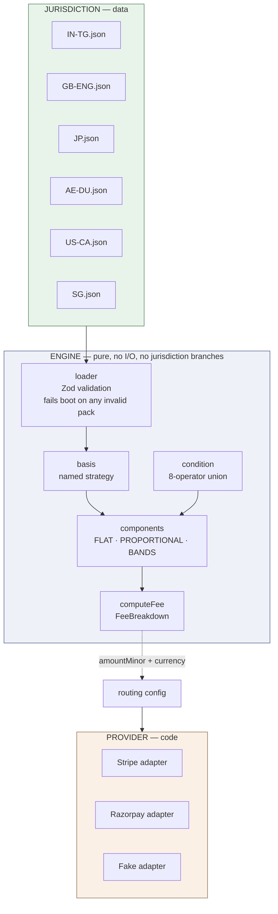
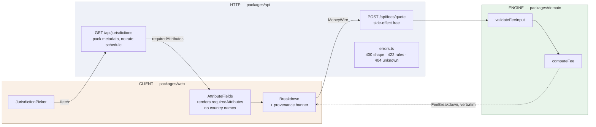

# Architecture

Structural decisions and layout. See [README](../README.md) for the overview.

## Architecture

Two independent axes of pluggability, deliberately kept apart:



**Jurisdiction is data. Provider is code. They meet only in routing config.**

Conflating them is the design mistake this structure exists to avoid: if the fee
rules lived in code, every new country would be a deployment; if the gateway
integration lived in data, the adapter's error handling would be
unrepresentable. Six countries cost six JSON files. Two gateways cost two
adapters. Neither multiplies the other.

The engine contains **zero jurisdiction-specific branching**, and that is
enforced by a test that reads the source (see
[The guards](#the-guards-tests-that-read-the-source)).

---

## The layers above the engine



Three properties hold across this boundary.

**There is no DTO layer.** `FeeBreakdown` holds `MoneyWire`, not `Money`, so the
engine's return value *is* the response body. That looked odd when it was
written and it was written for this.

**Validation is not duplicated.** The HTTP layer parses shapes with Zod; whether
an input is *legal* is decided by `validateFeeInput`, which the domain exports
for exactly this. A 400 means malformed; a 422 means the rules said no.

**The client cannot compute a fee.** `GET /api/jurisdictions` returns a pack's
metadata but never its `components`, so the rate schedule stays server-side.
The browser asks what something costs; it does not work it out.

The no-jurisdiction-branching guard now covers `packages/api/src` and
`packages/web/src` too. Without that, the engine's pluggability would be real
and worthless — undone by one `switch` in a route or one `CaliforniaForm.tsx`.

---


## Layout

```
payment-gateway/
├── packages/domain/          Pure domain. No I/O except the pack loader.
│   ├── src/money/            Money, currency registry, rounding, wire, format
│   ├── src/fees/             Schema, condition, basis, components, compute, loader
│   └── tests/
│       ├── money/  fees/     Unit and golden tests
│       └── guards/           Tests that read the source text
├── config/
│   ├── jurisdictions/        6 versioned rule packs — SYNTHETIC data
│   └── fixtures/             19 golden cases pinning every computation
├── packages/api/             HTTP layer. Express; no persistence, no auth.
│   ├── src/routes/           jurisdictions, quote
│   ├── src/errors.ts         domain error → status code, in one place
│   └── tests/guards/         no-jurisdiction-branch, over api/ and web/
├── packages/web/             React 19 + Vite client. Talks HTTP only.
│   ├── src/components/       Picker, AttributeFields, Breakdown, banner
│   └── src/money.ts          MoneyWire → glyphs, never through a JS number
├── tools/quote.ts            CLI; does the same work as the quote endpoint
├── design/                   Interface design canvas (15 artboards)
└── docs/superpowers/
    ├── specs/                Requirements (PRD)
    └── plans/                Implementation plans
```

### Interface design

Fifteen screens — citizen flow in nine, operations in four, plus foundations —
covering the jurisdiction picker, per-market quote screens for all five wired
jurisdictions, hosted checkout, a declined state, a print-fidelity receipt, the
clerk queue, the admin event timeline, reconciliation, and the jurisdiction
registry:

**[View the design canvas →](https://claude.ai/code/artifact/688c8d90-3d7d-424e-81e3-e144c7d10179)**

---

